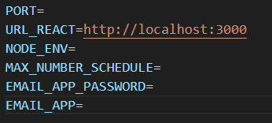
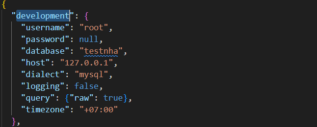
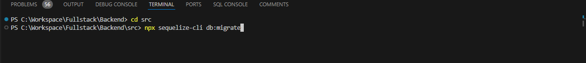
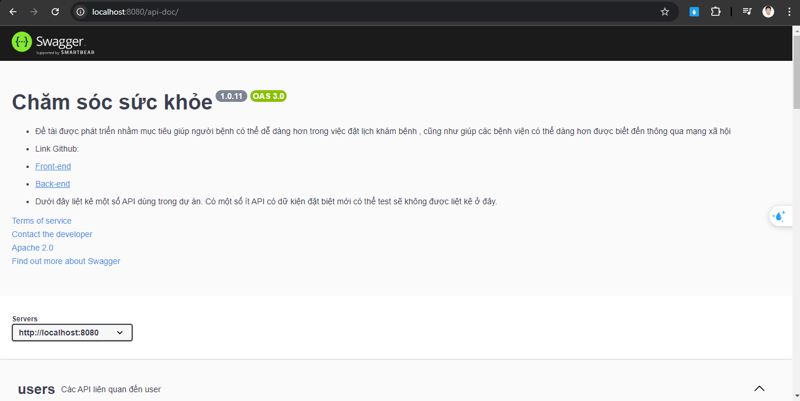
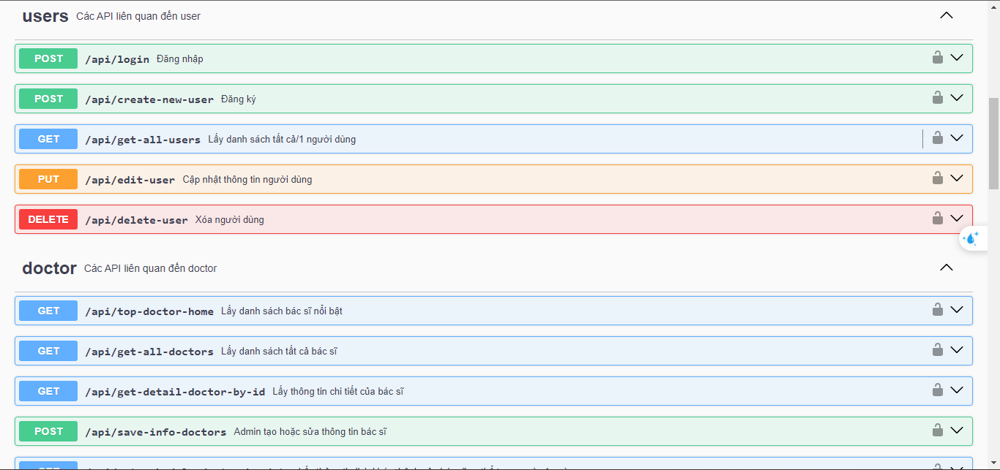

## Hướng dẫn cài đặt

### Đây là phần hướng dẫn cài đặt phía back-end thực hiện bằng nodeJS(expressJS).

- Các bạn git clone hoặc tải trực tiếp project về máy

- Sau đó gỏ chạy lên npm install để tải các package cần thiết của project

## Lưu ý: Phải sử dụng Node version là 14.17.0 để cho ra kết quả tốt nhất ko bị lỗi thư viện, package

## Có thể tìm hiểu thêm tải trình quản lý version Nodejs là nvm

- Ở file .env.example sẽ lưu trữ các biến môi trường

- PORT= là port của phần back-end.

> Ví dụ truyền vào là 8080 thì sẽ truy cập vào localhost:8080

- URL_REACT= là địa chỉ url của bên front-end ReactJS.

  > Ví dụ http://localhost:3000

- NODE_ENV= là biến để kết nối tới SQL có thể xem thêm ở file config.json

  > Ví dụ ở ta muốn kết nối đến biến có tên development ở file config.json
  > 
  > ở đó trong biến development có username,password,.. và các trường cần thiết cho việc kết nối đến DB. Bạn có thể điều chỉnh cho phù hợp với DB của bạn.

- MAX_NUMBER_SCHEDULE = Là biến để giới hạn(limit lại ) số lượng lịch trình của bác sĩ

  > Ví dụ ghi vào là 10

- EMAIL_APP_PASSWORD = là biến lưu trử "Mật khẩu ứng dụng"(App password) của email của bạn (Nhớ đừng đưa password này cho bất kỳ ai)

  > Có thể xem tham khảo cách tạo mật khẩu ứng dụng tại đây: https://support.google.com/mail/answer/185833?hl=vi

- EMAIL_APP = là biến lưu trữ địa chỉ email của bạn
  > Ví dụ như là abc@gmail.com

# => Hai trường trên là để có thể gửi mail từ email bạn đã nhập vào cho người bệnh

---

## Tiếp tục tạo cơ sở dữ liệu

- Điều kiện là bạn phải thực hiện được các bước trên là điều chỉnh lại kết nối DB phù hợp ở file config.json

> - Tiếp theo mở Terminal (Ctrl + `) truy cập đến src
> - Gỏ tiếp lệnh: npx sequelize-cli db:migrate
>   

Khi gỏ xong DB của bạn đã có các bảng cần thiết để sử dụng

- Tiếp theo vào bảng (Table) Allcode trong DB gỏ các lệnh truy vấn này vào để lấy các keymap dữ liệu

> https://docs.google.com/spreadsheets/d/1MV654Tf2BvI7oaggIhrJYQG_NvHXS0TFKN-Q8LR3Cus/edit?hl=vi&gid=0#gid=0
> (Ở cột SQL)

- Mở tiếp bảng users để tạo tài khoản admin để truy cập vào trang admin nha:

> Ở đây để cho tiện thì mình có tạo sẳn swagger giúp các bạn test API tại chổ luôn.
> Các bạn truy cập vào http://localhost:8080/api-doc/ để test API nha
>  > 
> Các bạn tạo giúp mình tài khoản admin thông qua
> /api/create-new-user (đăng ký): Các bạn cứ ấn vào Try it out, mình đã điền sẳn một tài khoản admin mẫu có các bạn rồi, chỉ việc ấn Execute thôi.

> Các trường như roleId, positionId, gender, các bạn muốn biết dữ liệu mình ghi dưới dạng keymap là gì thì mở lại DB allcode xem nha.

- Tiếp theo cài đặt front-end
- Link front-end: https://github.com/179-Harry-Lee/Frontend_Fullstack_Web.git
